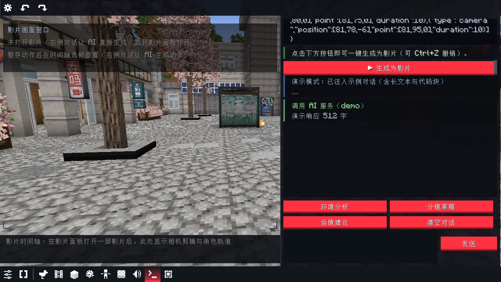

# AI 编辑器

专门的 AI 动画生成界面（`Ctrl+Shift+S` 或仪表盘任务栏终端图标）。

## 布局

| 区域 | 内容 |
|---|---|
| 左上 | **画面窗口**：实时观察游戏世界、演员与锚定预览，叠加当前影片信息 |
| 左下 | **影片时间轴**：当前影片的相机剪辑条块 + 角色轨道，点击选中剪辑 |
| 右上 | **对话区**：Codex 风格卡片（角色标头 + 左色条），AI 回复中的 storyboard/motion 代码块自动渲染为「生成为影片 / 预览动作」按钮 |
| 右中 | **思维链 / 工具调用日志**：AI 每一步（请求/解析/执行）的状态与结果 |
| 右下 | 快捷指令（环境分析/分镜草稿/运镜建议/清空）+ 输入框（`Ctrl+Enter` 发送） |

## 快捷指令

- **环境分析**：本地自动识别已装 mod（无需 API），注入对话作为选角/场景参考
- **分镜草稿** / **运镜建议**：填入提示模板

## 撤销

- `Ctrl+Z` / `Ctrl+Y`、顶栏按钮、`/bbs_ai undo|redo`
- 生成影片：撤销 = 删除；合并进当前影片：撤销 = 恢复生成前快照
- 暂存动作：撤销 = 丢弃预览
