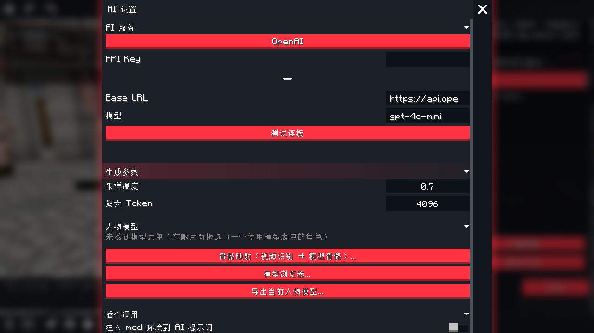

# AI 设置

从 AI 编辑器顶栏齿轮进入（或 `Ctrl+Shift+S` 后顶栏）。

- **AI 服务**：厂商切换（自动填充 Base URL 与模型）、API Key 掩码显示、测试连接
- **生成参数**：采样温度（0~2）、最大 Token（256~8192）
- **人物模型**：骨骼映射（视频识别骨骼 → 当前模型骨骼）、模型浏览器、导出 .bbsm
- **插件调用**：mod 环境注入开关、各 mod 适配器独立启停（持久化）、重新扫描

API Key 加密存储（AES-GCM，密钥派生自玩家 UUID）。
