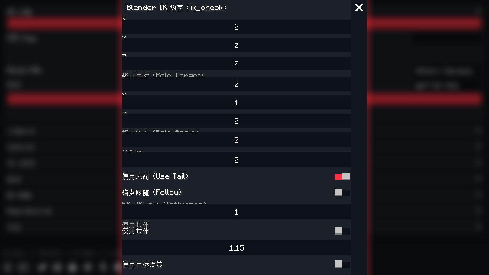

# AI 工具面板

原生内容辅助面板（仪表盘任务栏处理器图标）。

折叠区块：

- **AI 设置**：厂商 / API Key（掩码）/ Base URL / 模型 / 测试连接
- **分镜生成**：已迁移至 AI 编辑器（跳转按钮）
- **视频识别**：本地 ONNX 姿态估计（mp4/avi/mov/webm → 角色关键帧），支持镜像与脚部锁定
- **导入管理**：扫描 ai_cache / imports 目录的动作数据，预览与烘焙
- **模型**：人物模型功能已迁至人物模型编辑页（跳转）
- **IK 调整**：约束面板 / 解算并预览 / 烘焙
- **Mod 兼容环境**：自动识别的 mod 列表（知识库/统计/适配器说明）、重新扫描、导出 AI 知识库
- **界面**：主题（经典 BBS/Blender 深色/Mine-imator）、语言、操作模式、热键设置
