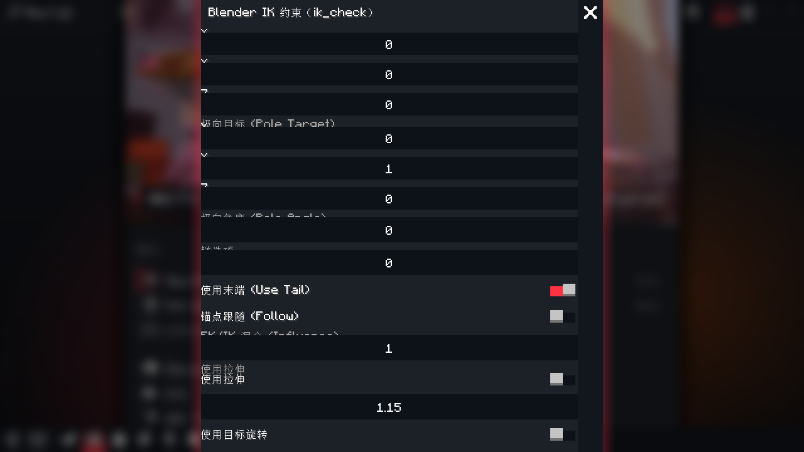

# 锚点跟随（手/脚）

末端效应器（手/脚）旋转时的锚点联动。三层实现：

1. **约束面板**：AI 工具 → IK 调整 → 打开约束面板 → 「锚点跟随（手/脚）」区块
   - 模式：无 / 脚部贴地 / 手部抓附
   - 强度（0~1）与释放阈值（度；末端旋转偏移超阈值即解除锚定——脚抬步/手松开）
2. **角色属性页**（2.7）：影片编辑器选中角色 → 属性面板底部 AI 锚点跟随控件（与约束面板共享状态）
3. **渲染链**（2.7）：`FormPoseEvents.MODEL_POSE` 在动画与 IK 之后应用贴地补偿（RENDER pass）

解算结果走预览系统：确认（Ctrl+Enter）后烘焙进角色关键帧。
